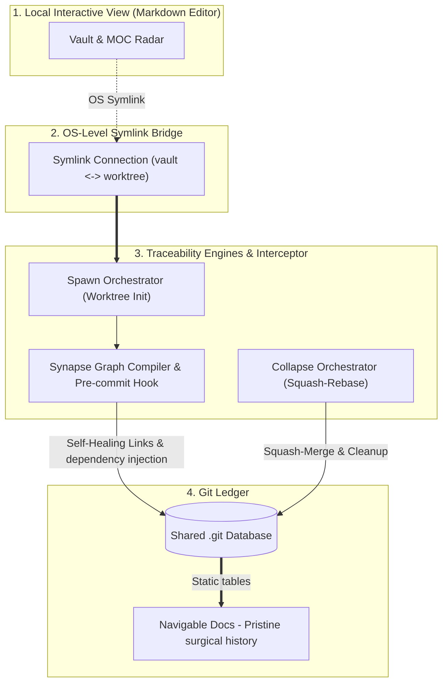

# Traceability System

> A deterministic, local-first traceability engine that unifies Docs-as-Code 
> infrastructure, business validation, and technical execution into an 
> automated Single Source of Truth.

## Powered by 4 Core Automation Engines &  1 Interceptor Mechanism

### Engines
1. **The Omni-Lingual Regex Graph Compiler `synapse parser`:** The heart of the system. Treats all files across multi-language source code and documentation as raw text streams. It extracts immutable identifiers bound between `@trace` and `@` keywords, validates them against allowed artifact prefixes (e.g., `REQ-001`, `ADR-001`), filters out duplicates, and natively handles both single and multi-keyword files to build the interconnected dependency graph data in milliseconds.
2. **The Git Worktree & Symlink Orchestrator (`spawn`):** Instantly spins up isolated sandbox worktrees and maps OS-level symlink bridges into your vault for zero-friction branch switching.
3. **The Automatic Dual-Vector Radar Engine (`synapse` MOCs constructor ):** An AST/Regex compiler that scans multi-language and multi-artifact environments, auto-heals relative Unix paths, automatically classifies file-to-artifact relationships across title prefixes and extensions, handles hand written external urls, rendering zero-maintenance MOC radars within each artifact.
4. **Workflow Collapse Orchestrator (`collapse`):** Automates sandbox sanitization, ensures clean commit history through a frictionless experience by automating git operations such as path finding, worktree and branch deletion, rebase, and merge in less that 2 seconds. 

### The Pre-Commit Pipeline (Interceptor Mechanism)

Absolute automation of metadata synchronization. Zero manual path maintenance. Every commit automatically triggers the self-healing link validation engine and document state binding before touching the main ledger.


## System Radar (Core features)

| Category | Immutable Pointer | Semantic Title & Route | Operational Scope & Description |
| :--- | :--- | :--- | :--- |
| 📕 **Architecture** | `TSO-ADR-011` | [Unidirectional_Artifact_Traceability_Protocol](docs/architecture/TSO-ADR-011_Unidirectional_Artifact_Traceability_Protocol.md) | Establishes operational rules for an indestructible Docs-as-Code traceability network to prevent cognitive drift, eliminate merge conflicts on global design laws, and ensure cross-platform portability. |
| 📐 **Vertical Slice** | `TSO-VS-006` | [Automatic_File_Connections](docs/architecture/TSO-VS-006_Automatic_File_Connections.md) | Vertical slice blueprint for automated reference resolution and multi-language parsing pipelines. |
| 📓 **Requirements** | `TSO-REQ-025` | [Synapse_Pre-commit_Hook](docs/requirements/TSO-REQ-025_Synapse_Pre-commit_Hook.md) | Autonomous pre-commit hook interceptor ensuring zero broken relative paths before committing. |
| 📓 **Requirements** | `TSO-REQ-024` | [Workflow_Worktree_Closure_&_Collapse_Orchestrator](docs/requirements/TSO-REQ-024_Workflow_Worktree_Closure_&_Collapse_Orchestrator.md) | Automates worktree destruction, branch deletion, and history sanitization via rebase to keep the commit ledger clean from `wip` states. |
| 📓 **Requirements** | `TSO-REQ-023` | [Git_Worktree_Set_Up_&_Spawn_Orchestrator](docs/requirements/TSO-REQ-023_Git_Worktree_Set_Up_&_Spawn_Orchestrator.md) | Provides initialization commands for isolated Git worktree creation, symlink connections to the vault, and IDE launching. |
| 📓 **Requirements** | `TSO-REQ-020` | [Automatic_Connections_Engine](docs/requirements/TSO-REQ-020_Automatic_Connections_Engine.md) | Engine that automatically connects and updates the connections between files to artifacts and artifacts to artifacts. |

> *Note: Full system matrix spanning all REQs, ADRs, and Vertical Slices is indexed locally in [docs/MOC.md](./docs/TSO-MOC_Traceability_System.md).*

## System Overview


## Core Engineering Invariants & System Constraints

The engine enforces five architectural laws across the repository:

1. **Pointer-Value Decoupling:** File paths use immutable IDs ([PREFIX]-[TYPE]-[ID]_[Name].md) separated from mutable human semantics (e.g, `PRO-REQ-099_Readable_Title`). Developers can rename titles freely without breaking graph dependencies or Git history.

2. **Pointer-Value Reference:** When creating a dependency reference to leverage the `synapse parser` the inmutable structure that should be follow by identifiers reference bound between `@trace` and `@` keywords is ([TYPE]-[ID]) separated by a white space (e.g, `@trace CAD-001 CAD-002 @` ). 

3. **Unified Requirements (Single Source of Truth):** Business user stories and binary true/false technical acceptance criteria are permanently fused into a single REQ note, eliminating enterprise Jira/Confluence artifact fragmentation.

4. **Atomic Ledger Discipline (wip ➔ feat):** Intermediate development noise (wip: commits) is strictly isolated to local sandboxes and automatically crushed via soft-reset rebase into a single, pristine commit upon task completion leveraging the `spawn-engine` and `collapse-engine`. 

5. **The Isolation Barrier:** Hard drive worktrees are mapped to the active editor via OS-level symlink bridges, completely bypassing cloud sync race conditions of the developer Personal Knowledge Base, maintaining a local-first single source of truth and enabling integration with markdown editor capabilities.


## Engine Execution

### Global Installation via NPM
Install the engine globally as a reusable system:

```bash
npm install -g traceability-engine
```

### Quick Start
#### Configuration Contract
the system can be customized to your project needs enabling adding extra artifacts, different categories, different file extension to be classified within different categories.

If you want to make the contract appear you can run `synapse` or `spawn` and the contract will be created with the default settings and commited, after that you can modify manually the auto created `system-config.json` file to modify the system behavior.

I strongly recommend that after you modify the system config you run the next command to stage and commit the changes
````bash
sys-save
````

> *Note:* Navigate to the [TSO-ADR-010_Master_Configuration_Contract](docs/architecture/TSO-ADR-010_Master_Configuration_Contract_Integration.md) to understand in depth what are the expected configuration properties what each property achieves and how to customize the system to your project needs using the contract.

#### `synapse-engine`

The traceability engine is engineered for both active development and automated safety:

##### Dual-Mode Execution Architecture
###### Proactive Sync
Invoke anytime from the worktree or branch to which you want to build the dependency graph, validate configuration contracts, and bake  MOC radars into static Markdown tables for instant navegavility.

**Command**
````bash
synapse
````
###### Reactive Gatekeeping (`git commit`)
 Operates transparently via Git hooks as a deterministic safety barrier, auto-healing relative file paths and enforcing trace invariants before a commit seals.

To enable it you must set up the pre-commit hook by running in any of the worktrees:
````bash
traceability-system-init
```` 


#### `spawn-engine`
The first part of the developer workflow

##### Command
Is trigger with a base functionality using the command followed by the name of the worktree which will also be assign as the name of the branch

````bash
spawn <worktree-name>
````

##### Flags
* `--symlink` or `-s`
* `--code` or `-c`

> *Note:* to understand what each flag variation or combination achieves go to the requirement acceptance criteria [Git_Worktree_Set_Up_&_System_State_Set_Up](docs/requirements/TSO-SREQ-023A_Workflow_Initialization_&_file_System_State_Set_Up.md) 

#### `collapse-engine`
The second part of the developer workflow

##### Command
When a requirement implementation is fully complete, running the collapse command automates the final lifecycle closure. Run it over the specific worktree you want to:
* **Squash & Merge:** Collapses all intermediate `wip:` sandbox commits into a single atomic, pristine Conventional Commit merged directly into `main`.
* **Sandbox Incineration:** Safely destroys the isolated worktree branch and directory to clear state.
* **Symlink Realignment:** Automatically unlinks the active worktree editor bridge and remaps your workspace back to the root documentation tree.

```bash
  collapse
```

