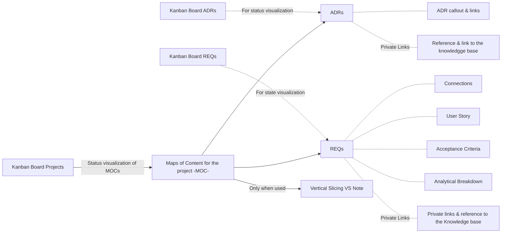

# **Traceability System**
Update to have the auto refactor script
## **🏛️ System Architecture**

## **⚡ Vertical Slicing**
Feature development connecting layers of the architecture to deliver one fully functional feature end-to-end.

| ID  | State      | Vertical Slicing Documentation                                                                      | Description                                                                                                                                         |
| --- | ---------- | --------------------------------------------------------------------------------------------------- | --------------------------------------------------------------------------------------------------------------------------------------------------- |
| 001 | Complete   | [Functional_REQ_Note_&_Artifacts](<./architecture/TSO-VS-001_Functional_REQ_Note_&_Artifacts.md>)   | All requirements related with the REQ note, each component                                                                                          |
| 002 | Complete   | [Functional_ADR_Note](<./architecture/TSO-VS-002_Functional_ADR_Note.md>)                           | What needs to be develop in order to have a functional ADR                                                                                          |
| 003 | Complete   | [Functional_MOC_Note](<./architecture/TSO-VS-003_Functional_MOC_Note.md>)                           | What should the central dashboard contain to visualize all the artifacts and main architecture diagrams of the project                              |
| 004 | Complete   | [Functional_Vertical_Slicing_Note](<./architecture/TSO-VS-004_Functional_Vertical_Slicing_Note.md>) | Feature development connecting layers of the architecture to deliver one fully functional feature end-to-end. Specifying connections to ADRs & REQs |
| 005 | Pending    | [Productivity_Boards](<./architecture/TSO-VS-005_Productivity_Boards.md>)                           | Have a kanban board that allows me to quickly group and identify the state or status of a given ADR, REQ or MOC                                     |
| 006 | In Process | [Automatic_File_Connections](<./architecture/TSO-VS-006_Automatic_File_Connections.md>)             |                                                                                                                                                     |

## 📓 **Requirements (REQs)**
| ID  | Requisite                                                                                                                              | Description                                                                                                                                                                                                                                                                                         |
| --- | -------------------------------------------------------------------------------------------------------------------------------------- | --------------------------------------------------------------------------------------------------------------------------------------------------------------------------------------------------------------------------------------------------------------------------------------------------- |
| 001 | [Maps_of_content_(MOCs)_&_Template](<./requirements/TSO-REQ-001_Maps_of_content_(MOCs)_&_Template.md>)                                 | The portal that connects the whole project documentation, provides automatic mapping to the content without manual intervention                                                                                                                                                                     |
| 002 | [Dictionary](<./requirements/TSO-REQ-002_Dictionary.md>)                                                                               | How to keep track of the ID's and keep a record of what each ID meant and identifies                                                                                                                                                                                                                |
| 003 | [Requirements_Structure](<./requirements/TSO-REQ-003_Requirements_Structure.md>)                                                       | The container for a specific functionality and a collection of artifacts to ensure that the requirement aligns with the project purpose and market fit                                                                                                                                              |
| 004 | [Kanban_Board_REQs](<./requirements/TSO-REQ-004_Kanban_Board_REQs.md>)                                                                 | How do I need to set up the kanban board in order for it to handle the REQs properly, which features of the board I need to leverage                                                                                                                                                                |
| 006 | [Template_User_Stories](<./requirements/TSO-REQ-006_Template_User_Stories.md>)                                                         | A gudind template to define user necessity and real world usefulness feature validation                                                                                                                                                                                                             |
| 007 | [Template_Acceptance_Criteria](<./requirements/TSO-REQ-007_Template_Acceptance_Criteria.md>)                                           |                                                                                                                                                                                                                                                                                                     |
| 008 | [Template_Structure_ADR's](<./requirements/TSO-REQ-008_Template_Structure_ADR's.md>)                                                   | Once the ADR'S structure is created you need to develop a ready to use template that translate to every MOC you'll create in the future                                                                                                                                                             |
| 010 | [Properties_For_MOC_Traceability](<./requirements/TSO-REQ-010_Properties_For_MOC_Traceability.md>)                                     |                                                                                                                                                                                                                                                                                                     |
| 011 | [Properties_For_Requisite_Traceability](<./requirements/TSO-REQ-011_Properties_For_Requisite_Traceability.md>)                         |                                                                                                                                                                                                                                                                                                     |
| 012 | [Properties_For_ADR's_Traceability](<./requirements/TSO-REQ-012_Properties_For_ADR's_Traceability.md>)                                 |                                                                                                                                                                                                                                                                                                     |
| 016 | [Kanban_Projects](<./requirements/TSO-REQ-016_Kanban_Projects.md>)                                                                     | The view where you manage the queque of the projects you're currently working on or plan to work at.                                                                                                                                                                                                |
| 017 | [Vertical_Slicing_Note_Structure_Template](<./requirements/TSO-REQ-017_Vertical_Slicing_Note_Structure_Template.md>)                   |                                                                                                                                                                                                                                                                                                     |
| 019 | [Kanban_board_For_ADRs](<./requirements/TSO-REQ-019_Kanban_board_For_ADRs.md>)                                                         | How do I need to set up the Kanban board in order for it to handle the ADRs properly, which features of the board I need to leverage                                                                                                                                                                |
| 020 | [Automatic_Connections_Engine](<./requirements/TSO-REQ-020_Automatic_Connections_Engine.md>)                                           | Engine that automatically connects and updates the connections between files to artifacts and artifacts to artifacts.                                                                                                                                                                               |
| 021 | [Vertical_Slicing_MOC_Template_&_Properties](<./requirements/TSO-REQ-021_Vertical_Slicing_MOC_Template_&_Properties.md>)               | Store and visualize Vertical Slicing diagrams                                                                                                                                                                                                                                                       |
| 022 | [From_DataView_To_Raw_Table](<./requirements/TSO-REQ-022_From_DataView_To_Raw_Table.md>)                                               | Turn DataView into functional raw markdown table for GitHub and IDE high quality open source navigability through the docs                                                                                                                                                                          |
| 023 | [Git_Worktree_Set_Up_&_Spawn_Orchestrator](<./requirements/TSO-REQ-023_Git_Worktree_Set_Up_&_Spawn_Orchestrator.md>)                   | This feature provides a system orchestrator initialization engine command with different functionalities trigger by a flag or combination of them that interact with, git worktree creation, symlink connection to your markdown editor folder & the  opening of your IDE for the specific worktree |
| 024 | [Workflow_Worktree_Closure_&_Collapse_Orchestrator](<./requirements/TSO-REQ-024_Workflow_Worktree_Closure_&_Collapse_Orchestrator.md>) | This feature ensures the git commit history remains clean from wips, and the closure remains frictionless by automating git operations such as path finding, worktree and branch deletion. Leaving the workspace clean and  ready to restart the workflow again for a new update or extra feature.  |

## **📕Architectural Decision Record (ADRs)**

| ID  | Architectural Decision                                                                                                                                 | Description                                                                                                                                                                                                                                                                 | State    |
| --- | ------------------------------------------------------------------------------------------------------------------------------------------------------ | --------------------------------------------------------------------------------------------------------------------------------------------------------------------------------------------------------------------------------------------------------------------------- | -------- |
| 001 | [Project_Folder_structure](<./architecture/TSO-ADR-001_Project_Folder_structure.md>)                                                                   |                                                                                                                                                                                                                                                                             | Pending  |
| 002 | [Symlinks](<./architecture/TSO-ADR-002_Symlinks.md>)                                                                                                   |                                                                                                                                                                                                                                                                             | Approved |
| 003 | [Global_Functional_File_Connection](<./architecture/TSO-ADR-003_Global_Functional_File_Connection.md>)                                                 |                                                                                                                                                                                                                                                                             | Approved |
| 004 | [Links_Accesibilty_To_The_Public](<./architecture/TSO-ADR-004_Links_Accesibilty_To_The_Public.md>)                                                     |  Link accessibility nuances                                                                                                                                                                                                                                                 | Approved |
| 005 | [Data_View_To_Raw_Links_Table](<./architecture/TSO-ADR-005_Data_View_To_Raw_Links_Table.md>)                                                           |                                                                                                                                                                                                                                                                             | Pending  |
| 008 | [Git_Staging_Workflow_Pristine_Version_Control_Engineering](<./architecture/TSO-ADR-008_Git_Staging_Workflow_Pristine_Version_Control_Engineering.md>) | How is the git workflow going to work what kind of flags will I use and what is its purpose. What will be the commit workflow                                                                                                                                               | Approved |
| 009 | [Synapse_Engine_Duplication_Solution](<./architecture/TSO-ADR-009_Synapse_Engine_Duplication_Solution.md>)                                             | The system when run for the second time with a .synapse-state.json fails completely to compare and define which link are hand written links because is using relative link to compare with absolute paths, identifying all as hand written, generating duplication.         | Approved |
| 010 | [Master_Configuration_Contract_Integration](<./architecture/TSO-ADR-010_Master_Configuration_Contract_Integration.md>)                                 | The system requires some rules and categories + single dev environment configurations. I need to find a way to integrate all this together to ensure the system is personalizable and resistant to cross-device sync                                                        | Approved |
| 011 | [Unidirectional_Artifact_Traceability_Protocol](<./architecture/TSO-ADR-011_Unidirectional_Artifact_Traceability_Protocol.md>)                         | Establishes the operational rules for maintaining an indestructible Docs-as-Code traceability network to prevent cognitive drift, eliminate merge conflicts on global design laws, and ensure cross-platform portability. The repository enforces a strict Lineage Protocol | Approved |
| 012 | [Symlink_Local_Storage](<./architecture/TSO-ADR-012_Symlink_Local_Storage.md>)                                                                         |                                                                                                                                                                                                                                                                             | Approved |

