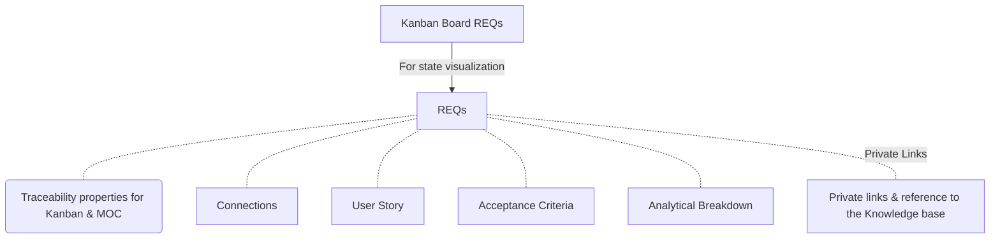

## Connections

| Type                | Route                                                                                         |
| :------------------ | :-------------------------------------------------------------------------------------------- |
| **📓 Requirements** | [TSO-REQ-003\_Requirements\_Structure](../requirements/TSO-REQ-003_Requirements_Structure.md) |

## Diagram

