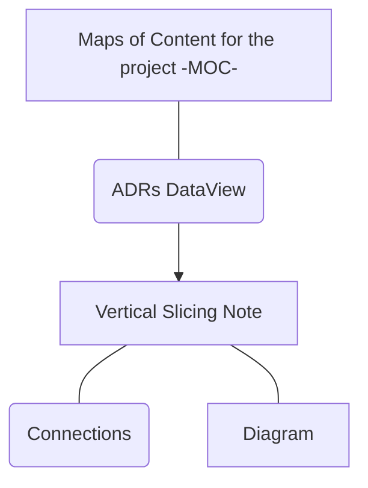

## Connections

| Type                | Route                                                                                                                                                                                                                                                                               |
| :------------------ | :---------------------------------------------------------------------------------------------------------------------------------------------------------------------------------------------------------------------------------------------------------------------------------- |
| **📓 Requirements** | [TSO-REQ-017\_Vertical\_Slicing\_Note\_Structure\_Template](../requirements/TSO-REQ-017_Vertical_Slicing_Note_Structure_Template.md) [TSO-REQ-021\_Vertical\_Slicing\_MOC\_Template\_&\_Properties](../requirements/TSO-REQ-021_Vertical_Slicing_MOC_Template_&_Properties.md) |

## Diagram

