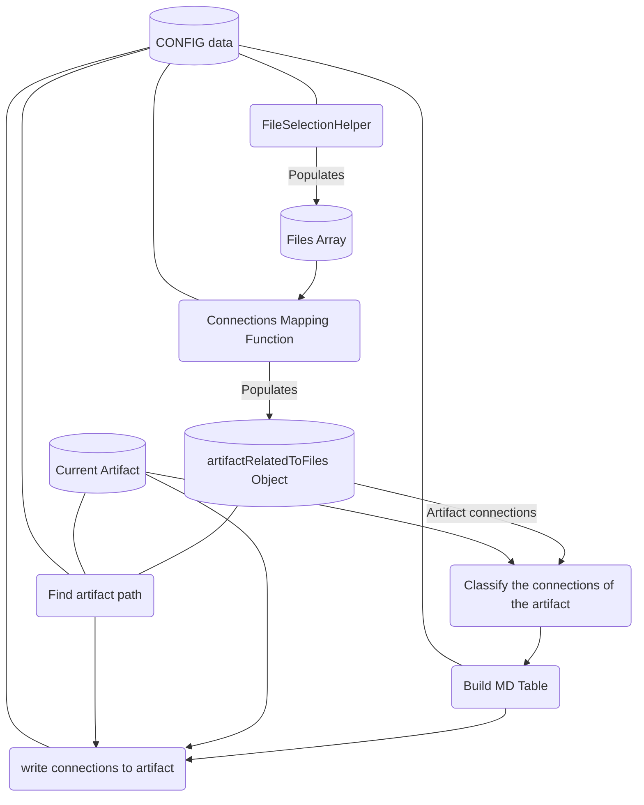

---
Project:
State: In Process
Description:
---

# Connections

| Type                | Route                                                                                                      |
| :------------------ | :--------------------------------------------------------------------------------------------------------- |
| **📕 Architecture** | [TSO-ADR-003\_Global\_Functional\_File\_Connection](TSO-ADR-003_Global_Functional_File_Connection.md)      |
| **📓 Requirements** | [TSO-REQ-020\_Automatic\_Connections\_Engine](../requirements/TSO-REQ-020_Automatic_Connections_Engine.md) |

# Diagram

